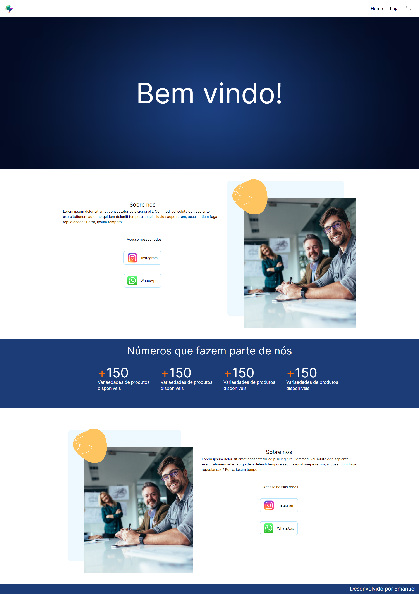
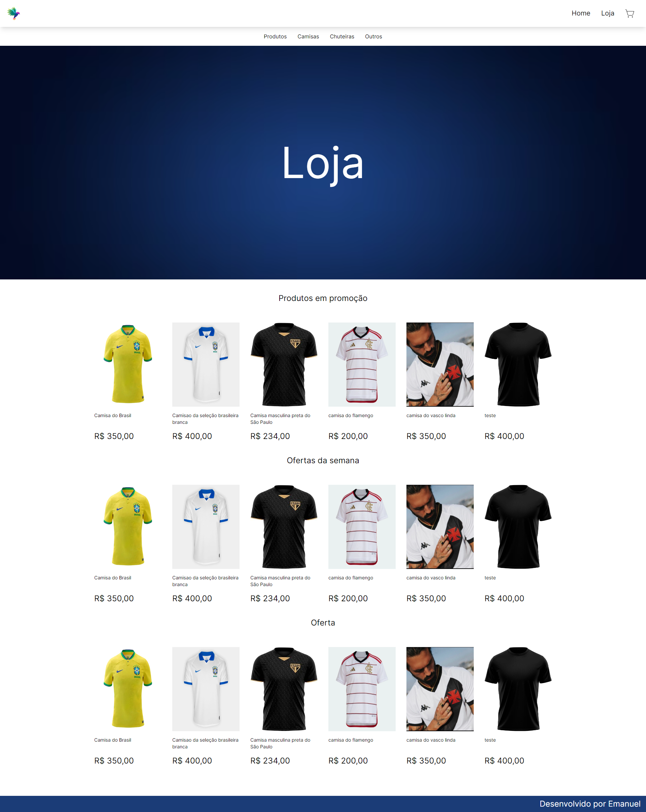

# Aplicação WEB com react - Next.JS
 
Primeiro projeto em que utilizo o react e o framework Next-JS, foi utilizado um banco de dados online, Supabase.

A aplicação está em desenvolvimento mas, já é possivel puxar os itens do banco de dados criado.

## Tecnologias utilizadas 

- React
- Typescript
- Javascript
- Tailwind-CSS
- HTML

## Imagens da aplicação

## Como executar

Para executar a aplicação, é necessario ter instalado o Node.js, um editor de código e instalar o Next.js.

Com o projeto aberto, basta dar o comando npm run dev, o projeto iniciará em seguida